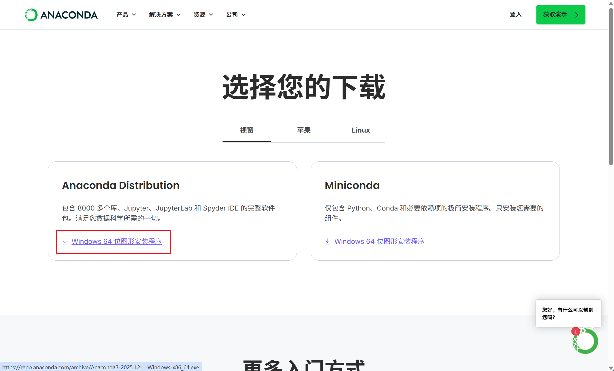
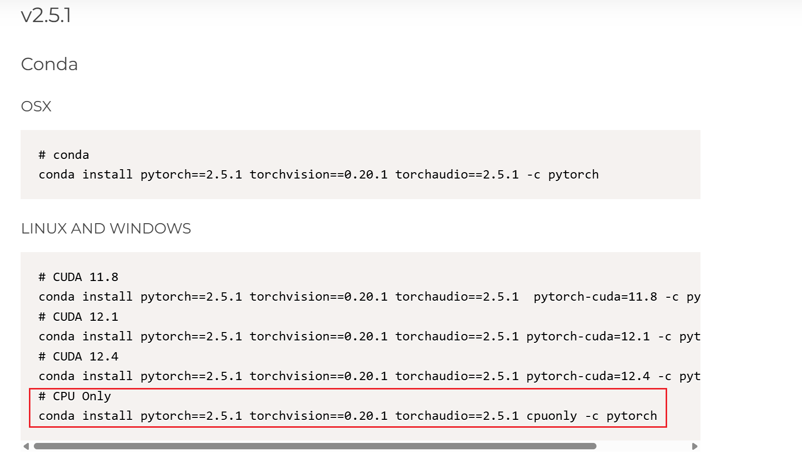
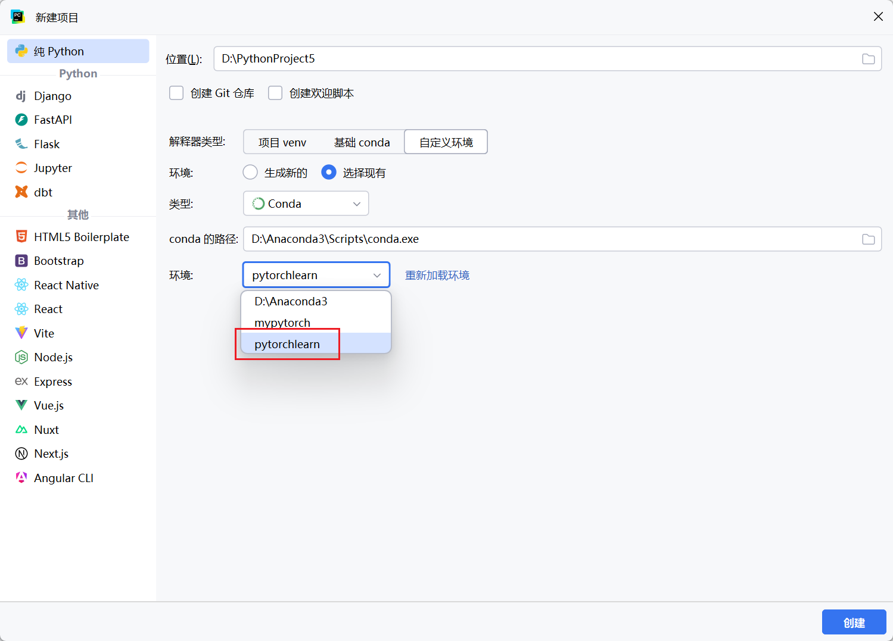
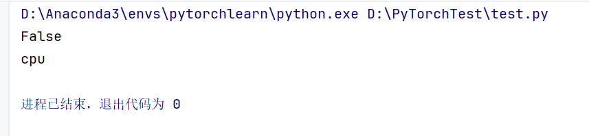

## 官方文档网址

学习指南：
https://docs.pytorch.org/tutorials/beginner/basics/quickstart_tutorial.html
API文档：
https://docs.pytorch.org/docs/stable/pytorch-api.html


## PyTorch的典型应用领域

- **计算机视觉（CV）**：图像分类、目标检测、生成模型（如 Stable Diffusion）。
- **自然语言处理（NLP）**：Transformer、LLM（如 GPT、BERT 等）。
- **强化学习（RL）**：与 Gym、RLlib 等结合实现智能体训练。
- **科学计算与量子机器学习**：通过 TorchQuantum 等库扩展。


## 环境配置

我们使用Anaconda作为Python的包管理工具


**1.Anaconda的安装**

https://www.anaconda.com/download/success




安装步骤：一直点击下一步，勾选环节全部选上，放在有空余的盘符上


**2.使用Anaconda创建环境**

创建"pytorchlearn"环境

```
# 打开"Anaconda Prompt"

# 创建环境
create -n pytorchlearn python=3.12

# 查看所有环境，确保环境创建成功
conda env list

# 进入(激活)环境
conda activate pytorchlearn

# 查看当前环境的库与包
conda list

# 退出环境，返回base环境
conda deactivate
```


**3.安装PyTorch**

https://pytorch.org/

在该网址中翻到下面，找到“Previous versions of PyTorch”，不推荐直接下最新版，建议下载较新的版本

之后找到conda支持的下载指令




```
# 进入环境
conda activate pytorchlearn

# 下载（最好开启科学上网）
conda install pytorch==2.5.1 torchvision==0.20.1 torchaudio==2.5.1 cpuonly -c pytorch
```


**4.将环境导入PyCharm**

新建项目，选择Conda，找到你创建的虚拟环境（若没有则重启电脑）




测试cpu版本环境

```python
import torch

flag = torch.cuda.is_available()
print(flag) # 返回 true 为cuda安装成功
ngpu = 1
# Decide which device we want to run on
device = torch.device("cuda:0" if (torch.cuda.is_available() and ngpu > 0) else "cpu")
print(device)


# # 有GPU的可以另外测试下面的，此处省略
# print(torch.cuda.get_device_name(0))
# print(torch.rand(3, 3).cuda())
# # Check CUDA version
# cuda_version = torch.version.cuda
# print("CUDA Version：", cuda_version)
# # Check CuDNN version
# cuda_version = torch.backends.cudnn.version()
# print("CuDNN Version:", cuda_version)

```

结果：




