# 一、PyTorch的引入


## 1、官方文档网址

学习指南：

https://docs.pytorch.org/tutorials/beginner/basics/quickstart_tutorial.html
API文档：

https://docs.pytorch.org/docs/stable/pytorch-api.html


## 2、PyTorch的典型应用领域

- **计算机视觉（CV）**：图像分类、目标检测、生成模型（如 Stable Diffusion）。
- **自然语言处理（NLP）**：Transformer、LLM（如 GPT、BERT 等）。
- **强化学习（RL）**：与 Gym、RLlib 等结合实现智能体训练。
- **科学计算与量子机器学习**：通过 TorchQuantum 等库扩展。


## 3、PyTorch的用户级API

PyTorch 是一个基于 Python 的科学计算库，它使用动态计算图（即“定义即运行”）机制，为深度学习研究和应用提供了灵活高效的实现。PyTorch 的用户级 API 主要分布在几个核心子模块中，包括 `torch`、`torch.nn`、`torch.optim`、`torch.utils.data` 等。下面分别介绍每个模块存放的主要功能。

1. `torch` 模块

`torch` 是 PyTorch 的核心库，提供了张量（Tensor）的基本定义和操作，类似于 NumPy，但支持 GPU 加速和自动微分。主要功能包括：

- **张量创建和操作**：如 `torch.tensor()`, `torch.zeros()`, `torch.ones()`, `torch.randn()` 等；支持索引、切片、数学运算、线性代数操作等。
- **自动微分**：通过 `torch.autograd` 模块，张量设置 `requires_grad=True` 后，PyTorch 会自动追踪所有操作，并调用 `.backward()` 计算梯度。
- **设备管理**：`torch.device` 用于指定计算设备（CPU/GPU），`tensor.to(device)` 可在设备间迁移数据。
- **随机数生成**：如 `torch.manual_seed()`, `torch.rand()`, `torch.randint()` 等。
- **数学函数**：包括逐元素运算、归约操作（如 `torch.sum()`, `torch.mean()`）、比较操作等。
- **分布式通信**：`torch.distributed` 提供多 GPU 分布式训练的支持。

2. `torch.nn` 模块

`torch.nn` 提供了构建神经网络所需的各种组件，以类和模块化的方式组织，便于定义和复用网络结构。主要功能包括：

- **网络层（Layers）**：如线性层（`nn.Linear`）、卷积层（`nn.Conv2d`）、循环层（`nn.LSTM`）、归一化层（`nn.BatchNorm2d`）、Dropout 等。
- **激活函数**：如 `nn.ReLU`, `nn.Sigmoid`, `nn.Tanh`, `nn.LeakyReLU` 等。
- **损失函数（Loss Functions）**：如 `nn.MSELoss`（均方误差）、`nn.CrossEntropyLoss`（交叉熵损失）、`nn.L1Loss` 等。
- **容器（Containers）**：`nn.Sequential` 用于顺序组合多个层，`nn.ModuleList` 和 `nn.ModuleDict` 用于注册子模块列表或字典。
- **参数管理**：`nn.Parameter` 将张量包装为可注册的参数，自动加入模型的参数列表。
- **实用工具**：如 `nn.utils.clip_grad_norm_` 用于梯度裁剪，`nn.Flatten` 用于展平张量等。

此外，`torch.nn.functional`（通常导入为 `F`）提供了与 `nn` 中类似的函数式接口（如 `F.relu`, `F.conv2d`），但没有内部状态，适用于无参数的操作。

3. `torch.optim` 模块

`torch.optim` 实现了各种优化算法，用于根据计算出的梯度更新模型参数。主要功能包括：

- **优化器类**：如 `optim.SGD`, `optim.Adam`, `optim.RMSprop`, `optim.Adagrad` 等。每个优化器接受一个需要优化的参数列表（通常来自 `model.parameters()`）和特定于算法的超参数（如学习率）。
- **学习率调度**：`torch.optim.lr_scheduler` 子模块提供学习率调整策略，如 `StepLR`, `ReduceLROnPlateau`, `CosineAnnealingLR` 等，可在训练过程中动态调整学习率。
- **参数分组**：优化器支持对不同参数组设置不同的超参数（例如不同层使用不同学习率）。

4. `torch.utils.data` 模块

`torch.utils.data` 提供了数据加载和预处理的工具，支持高效的数据流水线。主要功能包括：

- **Dataset 抽象类**：用户需要继承 `Dataset` 并实现 `__len__` 和 `__getitem__` 方法，以定义自己的数据集。PyTorch 也提供了一些内置数据集（如 `torchvision.datasets` 中的图片数据集）。
- **DataLoader 类**：将 `Dataset` 包装为可迭代对象，支持自动批处理（`batch_size`）、数据打乱（`shuffle`）、多进程加载（`num_workers`）以及自定义采样策略（`sampler`）。
- **Sampler**：定义数据集中索引的采样方式，如顺序采样（`SequentialSampler`）、随机采样（`RandomSampler`）和分布式采样（`DistributedSampler`）。
- **数据转换**：通常与 `torchvision.transforms` 配合使用，对数据进行预处理（如归一化、数据增强）。虽然 `transforms` 属于 `torchvision`，但 `torch.utils.data` 的设计允许将任意转换函数集成到数据加载流程中。

5. 其他相关模块

- **`torchvision`**：虽然不是核心库，但它是 PyTorch 官方提供的计算机视觉工具包，包含常用数据集、模型架构（如 ResNet）、图像转换操作等。
- **`torchtext`**：用于自然语言处理的数据工具包。
- **`torchaudio`**：用于音频处理的工具包。

**总结**

这些模块共同构成了 PyTorch 的用户级 API，形成了一个从数据处理、模型构建、训练优化到推理的完整流程。简单来说：
- `torch` 提供底层张量运算和自动微分；
- `torch.nn` 提供高层神经网络组件；
- `torch.optim` 实现参数更新算法；
- `torch.utils.data` 管理数据加载和预处理。

开发者可以通过组合这些模块，灵活地设计和训练深度学习模型。


## 4、环境配置

我们使用Anaconda作为Python的包管理工具


**1.Anaconda的安装**

https://www.anaconda.com/download/success


安装步骤：一直点击下一步，勾选环节全部选上，放在有空余的盘符上


**2.使用Anaconda创建环境**

创建"pytorchlearn"环境

```
# 打开"Anaconda Prompt"

# 创建环境
create -n pytorchlearn python=3.12

# 查看所有环境，确保环境创建成功
conda env list

# 进入(激活)环境
conda activate pytorchlearn

# 查看当前环境的库与包
conda list

# 退出环境，返回base环境
conda deactivate
```


**3.安装PyTorch**

https://pytorch.org/

在该网址中翻到下面，找到“Previous versions of PyTorch”，不推荐直接下最新版，建议下载较新的版本

之后找到conda支持的下载指令


```
# 进入环境
conda activate pytorchlearn

# 下载（最好开启科学上网）
conda install pytorch==2.5.1 torchvision==0.20.1 torchaudio==2.5.1 cpuonly -c pytorch
```


**4.将环境导入PyCharm**

新建项目，选择Conda，找到你创建的虚拟环境（若没有则重启电脑）


测试cpu版本环境

```python
import torch

flag = torch.cuda.is_available()
print(flag) # 返回 true 为cuda安装成功
ngpu = 1
# Decide which device we want to run on
device = torch.device("cuda:0" if (torch.cuda.is_available() and ngpu > 0) else "cpu")
print(device)


# # 有GPU的可以另外测试下面的，此处省略
# print(torch.cuda.get_device_name(0))
# print(torch.rand(3, 3).cuda())
# # Check CUDA version
# cuda_version = torch.version.cuda
# print("CUDA Version：", cuda_version)
# # Check CuDNN version
# cuda_version = torch.backends.cudnn.version()
# print("CuDNN Version:", cuda_version)

```

结果：


## 5、实现一个简单的线性神经网络

实现一个简单的线性神经网络，网络函数为$y=2x+1$


分为5步骤：

1.构造数据x，形状为(100,1)即100行1列，对应构造出y=2*x+1+noise，y形状与x的形状相同

2.构建线性模型,nn.Linear(1,1)，输入的特征数为1，输出得标签为1（一个x，一个y）

3.定义损失函数与优化器

4.训练模型: 前向传播=>计算损失=>清空梯度=>反向传播=>更新参数

5.打印出模型的参数w、b(w大致为2，b大致为1)

```python
import torch
from torch import nn, optim

# 1.构造数据
# 1.1.构造特征
x = torch.linspace(-5, 5, 100)  # 生成100个从-5到5,均匀分布的100个点
#print(x, x.shape)  # 构造出100个值，维度是(100)
# tensor([-5.0000, -4.8990, -4.7980, -4.6970, -4.5960, -4.4949, -4.3939, -4.2929,
#         -4.1919, -4.0909, -3.9899, -3.8889, -3.7879, -3.6869, -3.5859, -3.4848,
# 。。。。。。。。。。。。。。。。。。。。。。。。省略
#          3.8889,  3.9899,  4.0909,  4.1919,  4.2929,  4.3939,  4.4949,  4.5960,
#          4.6970,  4.7980,  4.8990,  5.0000])
x = x.unsqueeze(1)  # 把 100列 变成 100行1列，即(100,)->(100,1)
#print(x, x.shape)
# tensor([[-5.0000],
#         [-4.8990],
#         。。。。。。。。。。省略
#         [ 4.7980],
#         [ 4.8990],
#         [ 5.0000]]) torch.Size([100, 1])

# 1.2.生成标签y(y=2*x+1)
y = 2 * x + 1
# 给y添加噪音
noise = torch.randn(y.size())
y += noise
#print(y)
# tensor([[ -8.2897],
#。。。。。。。省略
#         [ 12.7701],
#         [ 12.2594]])

# 2.定义简单的线性模型
model = nn.Linear(in_features=1, out_features=1)

# 3.定义损失函数与优化器
criterion = nn.MSELoss()  # 损失函数：均方误差
optimizer = optim.SGD(model.parameters(), lr=0.01)  # 优化器

# 4.训练模型
epochs = 2000
for epoch in range(1,epochs+1):
    y_pred=model(x)             # 4.1.前向传播
    loss=criterion(y_pred,y)    # 4.2.计算损失
    optimizer.zero_grad()       # 4.3.清空梯度
    loss.backward()             # 4.4.反向传播
    optimizer.step()            # 4.5.更新参数

    print('轮次:{0}，损失值:{1}'.format(epoch,loss))

# 5.查看结果（查看两个参数w、b）
[w,b]=model.parameters(())
print('训练结果:w:{0},b:{1}'.format(w,b))

```

结果截图：

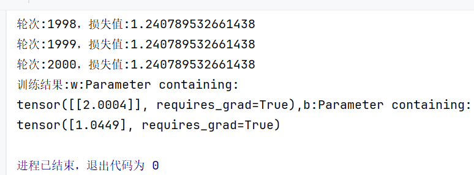


## 6、Matplotlib可视化工具

在原来的简单线性神经网络的基础上添加图片可视化

```python
import torch
from torch import nn, optim
import matplotlib.pyplot as plt

# 1.构造数据
# 1.1.构造特征
x = torch.linspace(-5, 5, 100)  # 生成100个从-5到5,均匀分布的100个点
x = x.unsqueeze(1)  # 把 100列 变成 100行1列，即(100,)->(100,1)
# 1.2.生成标签y(y=2*x+1)
y = 2 * x + 1
# 给y添加噪音
noise = torch.randn(y.size())
y += noise

# 2.定义简单的线性模型
model = nn.Linear(in_features=1, out_features=1)

# 3.定义损失函数与优化器
criterion = nn.MSELoss()  # 损失函数：均方误差
optimizer = optim.SGD(model.parameters(), lr=0.01)  # 优化器

# 4.训练模型
epochs = 200
losses = []
weights = []
biases = []
for epoch in range(1, epochs + 1):
    y_pred = model(x)  # 4.1.前向传播
    loss = criterion(y_pred, y)  # 4.2.计算损失
    optimizer.zero_grad()  # 4.3.清空梯度
    loss.backward()  # 4.4反向传播
    optimizer.step()  # 4.5.更新参数

    # 记录损失和参数
    losses.append(loss.item())
    weights.append(model.weight.item())  # 取出标量值
    biases.append(model.bias.item())

    print('轮次:{0}，损失值:{1}'.format(epoch, loss.item()))

# 5.查看结果（查看两个参数w、b）
[w, b] = model.parameters(())
print('训练结果:w:{0},b:{1}'.format(w, b))

# 6.绘制三个关系图
plt.figure(figsize=(12, 4))

# 损失 vs 轮次
plt.subplot(1, 3, 1)
plt.plot(range(1, epochs + 1), losses, color='blue')
plt.xlabel('Epoch')
plt.ylabel('Loss')
plt.title('Loss vs. Epoch')

# w vs 轮次
plt.subplot(1, 3, 2)
plt.plot(range(1, epochs + 1), weights, color='red')
plt.xlabel('Epoch')
plt.ylabel('Weight (w)')
plt.title('Weight vs. Epoch')

# b vs 轮次
plt.subplot(1, 3, 3)
plt.plot(range(1, epochs + 1), biases, color='green')
plt.xlabel('Epoch')
plt.ylabel('Bias (b)')
plt.title('Bias vs. Epoch')

plt.tight_layout()
plt.show()

```

效果图：

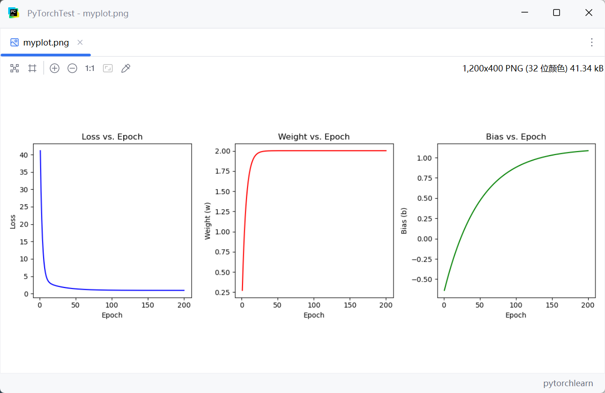


# 二、PyTorch具体模块函数使用


## 1、张量(Tensor)的定义与操作

张量是一种特殊的数据结构，与Python中的列表或者numpy中的ndarry非常相似。

在 PyTorch2 中，我们使用张量来定义模型的输入和输出，以及模型的参数。


### 1-1、Tensor的定义与创建

Tensor相当于多维列表，只不过操作起来效率比较高。


**Tensor的维度表达方式举例：**

(1,) :相当于1列的一维列表

(3,4):相当于3行4列的二维列表

(3,5,4):相当于3高5行4列的三维列表


**Tensor的创建实例:**

可以通过多种方式来创建张量，常见的有

- 从可迭代对象创建（例如python的list，numpy的ndarray即np.array）
- 使用 `torch.zeros` 创建全零张量
- 使用 `torch.ones` 创建全一张量
- 使用 `torch.rand` 创建随机张量

下面是示例：

```python
import torch
import numpy as np

# 1.使用可迭代对象创建张量
tensor_list=torch.tensor([[1,2,3],[3,4,5]]) # list创建
tensor_ndarray=torch.tensor(np.array([[1,2],[1,1]]))    # ndarray创建

# 2.创建全0张量
tensor_allzero=torch.zeros(size=(2,3),dtype=float)
print(tensor_allzero)
# tensor([[0., 0., 0.],
#         [0., 0., 0.]], dtype=torch.float64)

# 3.创建全1张量
tensor_allone=torch.ones(size=(1,2,3),dtype=int)
print(tensor_allone)
# tensor([[[1, 1, 1],
#          [1, 1, 1]]])

# 4.创建服从正态分布的随机张量，形状同tensor_allone
tensor_rand=torch.randn(size=tensor_allone.size())
print(tensor_rand)
# tensor([[[ 0.4665, -1.6945, -0.5514],
#          [-1.4522, -0.0440, -0.1852]]])

```


### 1-2、Tensor的四则运算

Tensor内部的实现中做好了四则运算的运算符的重载

```python
import torch

# 两个张量四则运算
tensor_a = torch.tensor([1, 2, 3])
tensor_b = torch.tensor([4, 5, 6])
# 加
sum_tensor = tensor_a + tensor_b
print(sum_tensor)       # tensor([5, 7, 9])
# 减
sub_tensor = tensor_a - tensor_b
print(sub_tensor)       # tensor([-3, -3, -3])
# 乘
product_tensor = tensor_a * tensor_b
print(product_tensor)   # tensor([4, 10, 18])
# 除
div_tensor = tensor_a / tensor_b
print(div_tensor)       # tensor([0.2500, 0.4000, 0.5000])


```


### 1-3、Tensor的矩阵乘法与转置

Tensor支持矩阵的相关操作，比如：矩阵乘法、转置

- Tensor使用torch.matmu函数也可以实现矩阵乘法
- Tensor使用自己的属性.T就可以直接获得转置

```python
import torch

# 1.矩阵乘法
matrix_a = torch.tensor([[1, 2], [3, 4]])
matrix_b = torch.tensor([[5, 6], [7, 8]])
matrix_product = torch.matmul(matrix_a, matrix_b)
print(matrix_product)
# tensor([[19, 22],
#         [43, 50]])

# 2.矩阵转置
matrix_c=torch.ones(size=(2,3),dtype=int)
print(matrix_c)
# tensor([[1, 1, 1],
#         [1, 1, 1]])
matrix_c_T=matrix_c.T
print(matrix_c_T)
# tensor([[1, 1],
#         [1, 1],
#         [1, 1]])
```


### 1-4、Tensor的拼接、切片、升降维

本节介绍Tensor的三个维度操作：拼接、切片、拓维

**1.Tensor的拼接**

使用`torch.cat`，第一个参数传入由待拼接张量构成的元组，第二个参数传入dim拼接的维度


**2.Tensor的切片**

使用方括号运算符`[]`


**3.Tensor的升维、降维操作**

使用tensor.unsqueeze进行升维

`torch.unsqueeze(input, dim)` 或 张量方法 `tensor.unsqueeze(dim)`，在指定的维度位置插入一个大小为 1 的新维度。

参数：

- `input`：输入的张量。
- `dim`：要插入维度的位置。可以是整数，范围从 `0` 到 `input.dim()`（包含两端）或者 范围从 `-input.dim()` 到 `-1`（包含两端）。负数表示从后往前数。


- 返回值：新张量，与原张量共享数据内存（即视图操作，不复制数据），但形状发生了变化。

直观理解：

假设有一个形状为 `(3, 4)` 的二维张量（矩阵），我们可以把它想象成 3 行 4 列的一个表格。

- 在 `dim=0` 处插入维度，新形状变为 `(1, 3, 4)`，相当于在最外层加了一个“厚度为1”的壳。（1高3行4列）
- 在 `dim=1` 处插入维度，新形状变为 `(3, 1, 4)`，相当于在行和列之间插入一个大小为1的维度。（3高1行4列）
- 在 `dim=2` 处插入维度，新形状变为 `(3, 4, 1)`，相当于在最后一维之后加了一个大小为1的维度。（3高4行1列）


使用tensor.squeeze进行降维：

**torch.squeeze(input)** 或 **tensor.squeeze()**：移除所有大小为 1 的维度。

举例：(3,1,2)=>(3,2) 、(3,1)=>(3,)

```python
import torch

# 1.Tensor的拼接
m_a=torch.tensor([[2,2,2],[2,2,2]])
m_b=torch.tensor([[3,3,3],[3,3,3]])
m_cat1=torch.cat((m_a,m_b),dim=0)   # 沿着列往下拼接
m_cat2=torch.cat((m_a,m_b),dim=1)   # 沿着行往右拼接
print(m_cat1)
# tensor([[2, 2, 2],
#         [2, 2, 2],
#         [3, 3, 3],
#         [3, 3, 3]])
print(m_cat2)
# tensor([[2, 2, 2, 3, 3, 3],
#         [2, 2, 2, 3, 3, 3]])

# 2.Tensor的切片
m_d=torch.tensor([[1,2,3],[4,5,6]])
m_cut=m_d[1:,0:2]   # 前面的是高维度
print(m_cut)
# tensor([[4, 5]])

# 3.Tensor的升维与降维
# 3.1.unsqueeze升维
m_e=torch.tensor([[1,2,3],[4,5,6]])
m_up=m_e.unsqueeze(dim=1)   # (2,3)->(2,1,3)
print(m_up)
# tensor([[[1, 2, 3]],
#         [[4, 5, 6]]])

# 3.2.squeeze降维
m_f=torch.tensor([[1],[2],[3],[4]])
m_down=m_f.squeeze()    # (3,1)->(3,)
print(m_down)
# tensor([1, 2, 3, 4])
```


## 2、自动微分（Autograd）与梯度优化

在PyTorch2中， 自动微分（Autograd）机制， 是 PyTorch 的核心功能之一，用于自动计算张量的导数（梯度）。

它的主要用途是：**在神经网络反向传播过程中自动计算参数的梯度**。

在 PyTorch 中，只要一个张量的属性 `requires_grad=True`，系统就会跟踪它的所有运算，从而可以在反向传播时自动求出梯度。

**基本原理**

- **计算图（Computational Graph）**：
  PyTorch 会动态构建一张有向无环图（DAG），图的节点是张量，边是函数（如加法、乘法等）。
  反向传播时，PyTorch 会沿着这张图从输出向输入依次计算梯度。
- **反向传播（Backpropagation）**：
  调用 `loss.backward()` 时，PyTorch 会自动计算所有参与计算的 `requires_grad=True` 张量的梯度。
- **梯度存储**：
  计算出的梯度会存放在每个张量的 `.grad` 属性中。

**简单示例**

```python
import torch

# 创建一个张量并启用自动求导
x = torch.tensor(3.0, requires_grad=True)

# 构建一个函数 y = x^2
y = x ** 2

# 自动求导（反向传播）
y.backward()

# 查看梯度 dy/dx
print(x.grad)  # 输出：tensor(6.)
print(x.grad.item())
```

运行输出：

```
tensor(6.)
6.0
```


**神经网络训练中使用 Autograd**

```python
import torch
from torch import nn, optim

# 1，构造训练数据：y=2x+1
x = torch.linspace(-5, 5, 100).unsqueeze(1)  # 100的样本，维度[100,1]
print(x, x.shape)
y = 2 * x + 1 + torch.randn(x.size())  # 添加噪声

# 2，定义简单的线性模型
model = nn.Linear(1, 1)

# 3, 定义损失函数与优化器
criterion = nn.MSELoss()  # 均方误差
optimizer = optim.SGD(model.parameters(), lr=0.01)

# 4，训练模型
epochs = 2000
for epoch in range(epochs):
    y_pred = model(x)  # 前向传播
    loss = criterion(y_pred, y)  # 计算损失
    optimizer.zero_grad()  # 清空梯度
    loss.backward()  # 反向传播
    optimizer.step()  # 更新参数

    print(f'epoch: {epoch}, loss: {loss.item()}')

# 5，查看结果
[w, b] = model.parameters()
print(f'训练结果：w: {w}, b: {b}')
```

**流程说明：**

1. `forward()` 前向传播，构建计算图
2. `loss.backward()` 反向传播，自动求出参数梯度
3. `optimizer.step()` 更新模型参数


## 3、数据集与数据加载

在 PyTorch 的训练流程中，**数据读取与预处理** 通常分为两部分：

- **Dataset（数据集类）**
  负责**定义样本获取方式**，即“如何读一条数据”。

- **DataLoader（数据加载器）**

  负责**批量加载与并行加速**，即“如何读多条数据”。

### 3_0_1、数据集类Dataset

基本使用方式

```python
from torchvision import datasets
from torchvision import transforms

transform = transforms.Compose([
    transforms.Resize(256),
    transforms.CenterCrop(224),
    transforms.ToTensor(),               # 将 PIL Image 或 numpy 转换为 Tensor，并缩放到 [0,1]
    transforms.Normalize(mean=[0.485, 0.456, 0.406], std=[0.229, 0.224, 0.225])
])

train_dataset = datasets.MNIST(root='./data', train=True, download=True, transform=transform)
```


### 3_0_2、数据加载器类DataLoader

常用参数

```python
from torch.utils.data import DataLoader

dataloader = DataLoader(
    dataset,
    batch_size=32,           # 每个 batch 的样本数
    shuffle=True,            # 每个 epoch 是否打乱数据
    sampler=None,            # 自定义采样策略（如果指定，则忽略 shuffle）
    batch_sampler=None,      # 返回 batch 索引的采样器
    num_workers=0,           # 加载数据使用的子进程数量（0 表示主进程加载）
    collate_fn=None,         # 如何将多个样本合并成一个 batch
    pin_memory=False,        # 是否将数据拷贝到 CUDA 固定内存（加速 GPU 传输）
    drop_last=False,         # 当样本数不能被 batch_size 整除时，是否丢弃最后一个不完整的 batch
    timeout=0,               # 数据加载超时时间
    worker_init_fn=None      # 每个 worker 进程初始化时执行的函数
)
```


基本使用方式

```python
train_loader = DataLoader(train_dataset, batch_size=64, shuffle=True, num_workers=4)

for images, labels in train_loader:
    # images 形状: (batch_size, channels, height, width)
    # labels 形状: (batch_size,)
    output = model(images)
    loss = criterion(output, labels)
    ...
```


完整使用流程

```python
import torch
from torch.utils.data import Dataset, DataLoader
from torchvision import transforms, datasets
import torch.nn as nn

# 1. 定义预处理
transform = transforms.Compose([
    transforms.RandomHorizontalFlip(),
    transforms.ToTensor(),
    transforms.Normalize((0.5, 0.5, 0.5), (0.5, 0.5, 0.5))
])

# 2. 加载内置数据集（或自定义）
train_dataset = datasets.CIFAR10(root='./data', train=True, download=True, transform=transform)

# 3. 创建 DataLoader
train_loader = DataLoader(train_dataset, batch_size=128, shuffle=True, num_workers=4, pin_memory=True)

# 4. 定义模型、损失函数、优化器
model = nn.Sequential(...).cuda()
criterion = nn.CrossEntropyLoss()
optimizer = torch.optim.Adam(model.parameters())

# 5. 训练循环
for epoch in range(num_epochs):
    for images, labels in train_loader:
        images, labels = images.cuda(), labels.cuda()
        outputs = model(images)
        loss = criterion(outputs, labels)
        optimizer.zero_grad()
        loss.backward()
        optimizer.step()
```


### 3-1、官方的数据集查看

```python
from torchvision import transforms
from torchvision.datasets import CIFAR10
from torch.utils.data import DataLoader
import numpy as np
import matplotlib.pyplot as plt

# 视觉处理
transform=transforms.Compose([
    transforms.Resize(size=224),
    transforms.ToTensor(),
])
# transform=transforms.Compose([
#     transforms.Resize(size=224),    # 转为大小为224*224
#     transforms.RandomHorizontalFlip(),  # 图像增强：横向反转
#     transforms.RandomCrop(size=224,padding=4),# 图像增强：随即裁剪，填充4
#     transforms.ToTensor(),
#     transforms.Normalize(
#         mean=[0.485, 0.456, 0.406],
#         std=[0.229, 0.224, 0.225]
#     )
# ])

# 数据集对象
train_data=CIFAR10(
    root='./CIFAR10_data',  # 放在哪个目录下
    train=True,             # 训练集为True，测试集为False
    download=True,
    transform=transform
)

# 数据加载器对象
train_dataloader=DataLoader(
    dataset=train_data,
    batch_size=32,
    shuffle=True,
    num_workers=0
)

# 取出其中一簇放入b_x、b_y
for step,(b_x,b_y) in enumerate(train_dataloader):
    # b_x为一簇图片数据，b_y是标签名
    if step>0:  # 只取出一簇，索引为1就结束
        break


batch_x = b_x.permute(0, 2, 3, 1).numpy()   # 形状从(batch,C,H,W)->(batch,H,W,C)
batch_y=b_y.numpy()
class_label=train_data.classes
print('所有分类:',class_label)

# 绘图
plt.figure(figsize=(12, 5))
for ii in np.arange(len(batch_y)):
    plt.subplot(4, 8, ii + 1)   # 4行8列显示
    plt.imshow(batch_x[ii, :, :])
    plt.title(class_label[batch_y[ii]], size=10)
    plt.axis("off")
    plt.subplots_adjust(wspace=0.05)
plt.show()
```

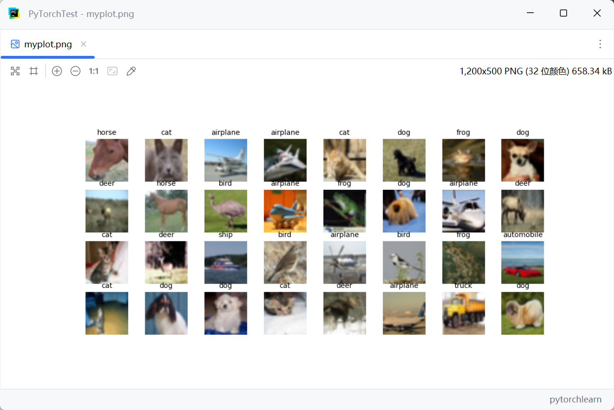


### 3-2、官方的数据加载器

```python
from torchvision import transforms
from torchvision.datasets import CIFAR10
from torch.utils.data import DataLoader
import numpy as np
import matplotlib.pyplot as plt

# 视觉处理
transform=transforms.Compose([
    transforms.Resize(size=224),    # 转为大小为224*224
    transforms.RandomHorizontalFlip(),  # 图像增强：横向反转
    transforms.RandomCrop(size=224,padding=4),# 图像增强：随即裁剪，填充4
    transforms.ToTensor(),
    transforms.Normalize(
        mean=[0.485, 0.456, 0.406],
        std=[0.229, 0.224, 0.225]
    )
])

# 数据集对象
train_data=CIFAR10(
    root='./CIFAR10_data',  # 放在哪个目录下
    train=True,             # 训练集为True，测试集为False
    download=True,
    transform=transform
)

# 数据加载器对象
train_dataloader=DataLoader(
    dataset=train_data,
    batch_size=32,
    shuffle=True,
    num_workers=4
)


for imgs,label in train_dataloader:
    print(imgs)
    print(label)

```


### 3-3、自己的数据集查看

自己的数据集结构：

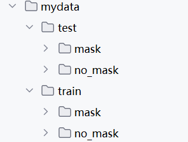

```python
from torchvision import transforms
from torchvision.datasets import ImageFolder
from torch.utils.data import DataLoader
import numpy as np
import matplotlib.pyplot as plt

# 训练数据预处理(包含增强)
train_transform = transforms.Compose([
    transforms.Resize((224,224)),
    transforms.ToTensor(),
])

# 加载训练集数据
train_dataset = ImageFolder(
    root='./mydata/train',
    transform=train_transform
)

# 数据加载器对象
train_dataloader=DataLoader(
    dataset=train_dataset,
    batch_size=32,
    shuffle=True,
    num_workers=0
)

# 取出其中一簇放入b_x、b_y
for step,(b_x,b_y) in enumerate(train_dataloader):
    # b_x为一簇图片数据，b_y是标签名
    if step>0:  # 只取出一簇，索引为1就结束
        break


batch_x = b_x.permute(0, 2, 3, 1).numpy()   # 形状从(batch,C,H,W)->(batch,H,W,C)
batch_y=b_y.numpy()
class_label=train_dataset.classes
print('所有分类:',class_label)

# 绘图
plt.figure(figsize=(12, 5))
for ii in np.arange(len(batch_y)):
    plt.subplot(4, 8, ii + 1)   # 4行8列显示
    plt.imshow(batch_x[ii, :, :])
    plt.title(class_label[batch_y[ii]], size=10)
    plt.axis("off")
    plt.subplots_adjust(wspace=0.05)
plt.show()
```


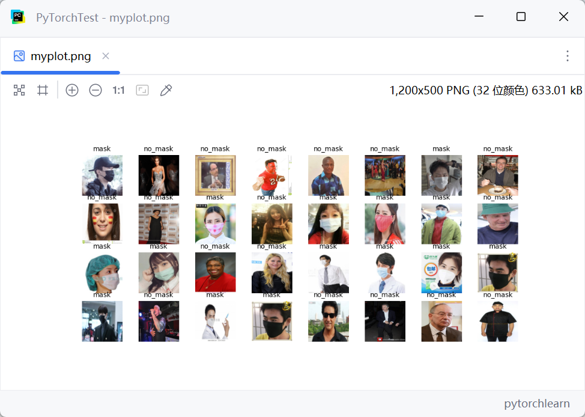


### 3-4、自己的数据加载器

```python
from torchvision import transforms
from torchvision.datasets import ImageFolder
from torch.utils.data import DataLoader
import numpy as np
import matplotlib.pyplot as plt

# 训练数据预处理(包含增强)
train_transform = transforms.Compose([
    transforms.Resize((224,224)),
    transforms.RandomHorizontalFlip(),
    transforms.RandomCrop(224, padding=4),
    transforms.ToTensor(),
    transforms.Normalize(
        mean=[0.687,0.589,0.430],
        std=[0.298,0.293,0.340]
    )
])

# 加载训练集数据
train_dataset = ImageFolder(
    root='./data/train',
    transform=train_transform
)

# 数据加载器对象
train_dataloader=DataLoader(
    dataset=train_dataset,
    batch_size=32,
    shuffle=True,
    num_workers=4
)


for imgs,labels in train_dataloader:
    print(imgs)
    print(labels)

```


# 三、PyTorch搭建神经网络

## 1、全连接神经网络(FNN)

### 1-1、FNN的结构

- **输入层**：接受输入数据，传递到下一层。
- **隐藏层**：进行数据处理的中间层，可能有多个。每一层都由神经元组成，每个神经元与前一层的所有神经元相连接。
- **输出层**：根据任务的要求输出最终的预测结果。

每个神经元通过加权求和后通过激活函数（如ReLU、Sigmoid、Tanh等）得到输出。模型的训练过程通过反向传播算法来优化参数。

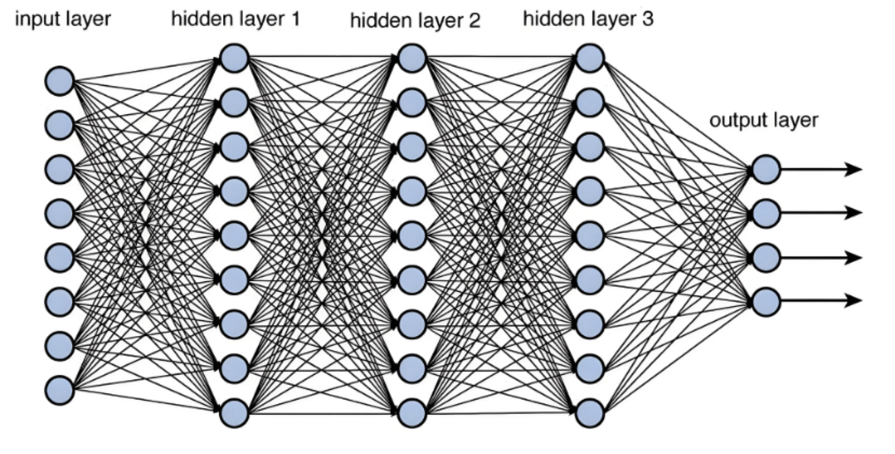


### 1-2、FNN处理鸢尾花多分类问题

```python
from sklearn.datasets import load_iris
import torch
from sklearn.metrics import accuracy_score
from sklearn.model_selection import train_test_split
from sklearn.preprocessing import StandardScaler

# 加载数据集
iris=load_iris()
X=iris.data         # 150个样本 4个特征
y=iris.target       # 3个类别（Setosa, Versicolor, Virginica）

# 特征标准化
scaler=StandardScaler()
X_scaled=scaler.fit_transform(X)

# 将数据集划分为训练集与测试集
X_train,X_test,y_train,y_test=train_test_split(X_scaled,y,test_size=0.2,random_state=42)

# 把数据转换成Tensor张量
X_train=torch.tensor(X_train,dtype=torch.float32)
y_train=torch.tensor(y_train,dtype=torch.long)
X_test=torch.tensor(X_test,dtype=torch.float32)
y_test=torch.tensor(y_test,dtype=torch.long)

# 创建数据集和数据加载器
train_dataset=torch.utils.data.TensorDataset(X_train,y_train)
train_loader=torch.utils.data.DataLoader(train_dataset,batch_size=32,shuffle=True)
test_dataset = torch.utils.data.TensorDataset(X_test, y_test)
test_loader = torch.utils.data.DataLoader(test_dataset, batch_size=32, shuffle=False)

# 定义全连接神经网络模型
class FNN(torch.nn.Module):
    def __init__(self,input_size,hidde_size,output_size):
        super(FNN,self).__init__()
        self.fc1=torch.nn.Linear(in_features=input_size,out_features=hidde_size)    # 输入层到隐藏层的全连接层
        self.relu=torch.nn.ReLU()   # 激活函数
        self.fc2=torch.nn.Linear(in_features=hidde_size,out_features=output_size)   # 隐藏层到输出层的全连接层

    def forward(self,x):
        x = self.fc1(x)  # 输入到隐藏层
        x = self.relu(x)  # 激活函数
        y = self.fc2(x)  # 隐藏层到输出层
        return y

# FNN内部参数规定
input_size=4    # 输入特征数
hidde_size=16   # 隐藏层节点数
output_size=3   # 输出分类数

# 模型实例化
FNN_model=FNN(input_size=input_size,hidde_size=hidde_size,output_size=output_size)

# 定义损失函数与优化器
criterion=torch.nn.CrossEntropyLoss()   # 交叉熵损失函数
optimizer=torch.optim.Adam(FNN_model.parameters(),lr=0.01)  # 优化器

# 训练模型
num_epochs=100
for epoch in range(num_epochs):
    FNN_model.train()   # 设置为训练模式
    for inputs,labels in train_loader:
        # 前向传播
        outputs=FNN_model(inputs)
        # 计算损失
        loss=criterion(outputs,labels)
        # 清空梯度
        optimizer.zero_grad()
        # 反向传播
        loss.backward()
        # 更新参数
        optimizer.step()

    # 输出当前轮次训练结果
    print(f'当前轮次:{epoch+1}/{num_epochs}.损失:{loss.item():.4f}')

# 测试模型
FNN_model.eval()    # 设置模型为测试模式
y_pred=[]
y_true=[]
with torch.no_grad():   # 禁用梯度计算(不用求导)
    for inputs,labels in test_loader:
        outputs=FNN_model(inputs)
        predicted = torch.argmax(outputs, dim=1)  # 直接获取最大概率的索引
        y_pred.extend(predicted.numpy())
        y_true.extend(labels.numpy())

# 计算准确率
accuracy = accuracy_score(y_true, y_pred)
print(f'Accuracy: {accuracy * 100:.2f}%')
```

结果截图:

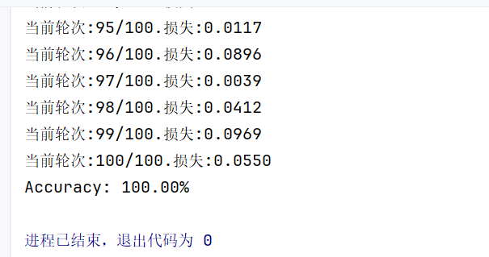


### 1-3、nn.Sequential简化FNN模型类

以类定义方式太麻烦了，所以我们用Sequential简化FNN模型类

```python
# 原版:
# 模型类定义
class FNN(torch.nn.Module):
    def __init__(self,input_size,hidde_size,output_size):
        super(FNN,self).__init__()
        self.fc1=torch.nn.Linear(in_features=input_size,out_features=hidde_size)    # 输入层到隐藏层的全连接层
        self.relu=torch.nn.ReLU()   # 激活函数
        self.fc2=torch.nn.Linear(in_features=hidde_size,out_features=output_size)   # 隐藏层到输出层的全连接层

    def forward(self,x):
        x = self.fc1(x)  # 输入到隐藏层
        x = self.relu(x)  # 激活函数
        y = self.fc2(x)  # 隐藏层到输出层
        return y
# 模型实例化
FNN_model=FNN(input_size=input_size,hidde_size=hidde_size,output_size=output_size)
   
    
    
# 简化版:
FNN_model=torch.nn.Sequential(
    torch.nn.Linear(in_features=input_size,out_features=hidde_size),
    torch.nn.ReLU(),
    torch.nn.Linear(in_features=hidde_size,out_features=output_size)
)
```


完整替换后的项目:

```python
from sklearn.datasets import load_iris
import torch
from sklearn.metrics import accuracy_score
from sklearn.model_selection import train_test_split
from sklearn.preprocessing import StandardScaler

# 加载数据集
iris=load_iris()
X=iris.data         # 150个样本 4个特征
y=iris.target       # 3个类别（Setosa, Versicolor, Virginica）

# 特征标准化
scaler=StandardScaler()
X_scaled=scaler.fit_transform(X)

# 将数据集划分为训练集与测试集
X_train,X_test,y_train,y_test=train_test_split(X_scaled,y,test_size=0.2,random_state=42)

# 把数据转换成Tensor张量
X_train=torch.tensor(X_train,dtype=torch.float32)
y_train=torch.tensor(y_train,dtype=torch.long)
X_test=torch.tensor(X_test,dtype=torch.float32)
y_test=torch.tensor(y_test,dtype=torch.long)

# 创建数据集和数据加载器
train_dataset=torch.utils.data.TensorDataset(X_train,y_train)
train_loader=torch.utils.data.DataLoader(train_dataset,batch_size=32,shuffle=True)
test_dataset = torch.utils.data.TensorDataset(X_test, y_test)
test_loader = torch.utils.data.DataLoader(test_dataset, batch_size=32, shuffle=False)

# FNN内部参数规定
input_size=4    # 输入特征数
hidde_size=16   # 隐藏层节点数
output_size=3   # 输出分类数

# 定义全连接神经网络模型
FNN_model=torch.nn.Sequential(
    torch.nn.Linear(in_features=input_size,out_features=hidde_size),
    torch.nn.ReLU(),
    torch.nn.Linear(in_features=hidde_size,out_features=output_size)
)


# 定义损失函数与优化器
criterion=torch.nn.CrossEntropyLoss()   # 交叉熵损失函数
optimizer=torch.optim.Adam(FNN_model.parameters(),lr=0.01)  # 优化器

# 训练模型
num_epochs=100
for epoch in range(num_epochs):
    FNN_model.train()   # 设置为训练模式
    for inputs,labels in train_loader:
        # 前向传播
        outputs=FNN_model(inputs)
        # 计算损失
        loss=criterion(outputs,labels)
        # 清空梯度
        optimizer.zero_grad()
        # 反向传播
        loss.backward()
        # 更新参数
        optimizer.step()

    # 输出当前轮次训练结果
    print(f'当前轮次:{epoch+1}/{num_epochs}.损失:{loss.item():.4f}')

# 测试模型
FNN_model.eval()    # 设置模型为测试模式
y_pred=[]
y_true=[]
with torch.no_grad():   # 禁用梯度计算(不用求导)
    for inputs,labels in test_loader:
        outputs=FNN_model(inputs)
        predicted = torch.argmax(outputs, dim=1)  # 直接获取最大概率的索引
        y_pred.extend(predicted.numpy())
        y_true.extend(labels.numpy())

# 计算准确率
accuracy = accuracy_score(y_true, y_pred)
print(f'Accuracy: {accuracy * 100:.2f}%')
```

结果截图：

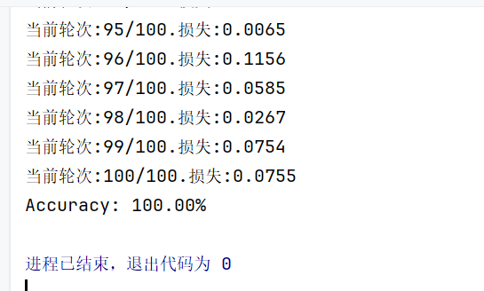


## 2、卷积神经网络(CNN)

### 2-1、卷积神经网络结构

CNN由多个不同层次的神经网络构成，每一层通过特定的操作提取图像或数据中的不同特征。主要的层包括：

- **输入层（Input Layer）：**输入图像等信息
- **卷积层（Convolutional Layer）**：这是CNN的核心部分，通过卷积操作提取输入数据（如图像）的局部特征。卷积操作是通过滤波器（或卷积核）对输入数据进行滑动，并计算每个位置的加权和，生成特征图。滤波器通常会学习到不同的图像特征，如边缘、纹理、颜色等。
- **激活层（Activation Layer）**：通常在卷积层、全连接层之后添加激活函数（如ReLU函数），引入非线性因素，使得网络可以学习到更复杂的模式。
- **池化层（Pooling Layer）**：池化操作的目的是减少数据的维度，从而减小计算量，同时保留重要的特征。最常见的池化操作是最大池化（Max Pooling）和平均池化（Average Pooling）。池化层通常用于减少图像尺寸（如2x2池化），降低计算负担。
- **展平层(Flatten Layer)**：处于卷积层与全连接层中间，用于将多个卷积核展平后输入全连接层，起到承上启下的作用。
- **全连接层（Fully Connected Layer）**：在卷积和池化层之后，通常会有一个或多个全连接层，用来将提取到的特征与最终的分类结果连接起来。全连接层通常用于最后的输出，例如图像分类的类别。
- **输出层（Output Layer）**：最后一层用于输出最终的预测结果，例如图像分类中每个类别的概率分布。


### 2-2、基于LeNet的CNN的手写数字识别

LeNet卷积神经网络结构如下图所示：
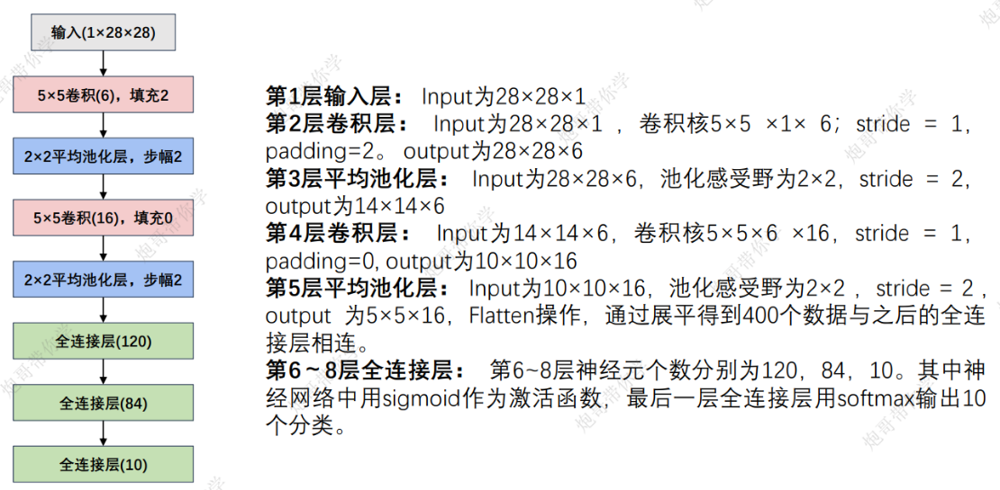

卷积层之后都需要接上sigmoid激活函数


代码如下：

```python
import time
import pandas as pd
from torchvision import transforms,datasets
from torch.utils.data import DataLoader
from torch import nn
import matplotlib.pyplot as plt
import torch

# 1.获取数据加载器
def getdataloader(batch_size):
    transform=transforms.Compose([
        transforms.Resize(size=(28,28)),    # 裁剪大小为28*28
        transforms.ToTensor(),  # 转为tensor
        transforms.Normalize(   # 因为只有黑白，在转为张量后压缩到了[0.1]，此处我们把他标准正态化
            mean=[0.5],
            std=[0.5]
        )
    ])

    # 训练集
    train_dataset=datasets.MNIST(
        root='./hand_num_data',
        train=True,
        transform=transform,
        download=True
    )
    # 训练数据加载器
    train_dataloader=DataLoader(
        dataset=train_dataset,
        batch_size=batch_size,
        shuffle=True
    )

    # 测试集
    test_dataset = datasets.MNIST(
        root='./hand_num_data',
        train=False,
        transform=transform,
        download=True
    )
    # 测试数据加载器
    test_dataset = DataLoader(
        dataset=test_dataset,
        batch_size=32,
        shuffle=True
    )

    all_classes=train_dataset.classes

    return train_dataset,train_dataloader,all_classes

# 2.LeNet模型
class LeNet(nn.Module):
    def __init__(self,output_size):
        super(LeNet,self).__init__()
        self.c1=nn.Conv2d(in_channels=1,out_channels=6,kernel_size=28,padding=2)
        self.relu=nn.ReLU()    # 激活函数(论文原文是sigmoid，这里修改乘relu)
        self.a=nn.AvgPool2d(kernel_size=14,stride=2)    # 平均池化层
        self.c2=nn.Conv2d(in_channels=6,out_channels=16,kernel_size=5)
        self.flatten=nn.Flatten()
        self.f1=nn.Linear(in_features=5*5*16,out_features=120)
        self.f2=nn.Linear(in_features=120,out_features=84)
        self.f3=nn.Linear(in_features=84,out_features=output_size)

    def forward(self,x):
        x=self.c1(x)
        x=self.relu(x)
        x=self.a(x)
        x=self.c2(x)
        x=self.relu(x)
        x=self.a(x)
        x=self.flatten(x)
        x=self.f1(x)
        x=self.relu(x)
        x=self.f2(x)
        x = self.relu(x)
        y=self.f3(x)
        return y

def train_epoch(model,train_loader,criterion,optimizer,device):
    """训练一个epoch"""
    model.train()
    running_loss=0.0
    correct=0
    total=0

    for batch_idx,(inputs,targets) in enumerate(train_loader):
        inputs=inputs.to(device)
        targets=targets.to(device)


        outputs=model(inputs)
        loss=criterion(outputs,targets)

        optimizer.zero_grad()
        loss.backward()
        optimizer.step()

        running_loss+=loss.item()
        predicted=outputs.argmax(1)
        total+=targets.size(0)
        correct+=predicted.eq(targets).sum().item()

    epoch_loss=running_loss/len(train_loader)
    epoch_acc=100.*correct/total

    return epoch_loss,epoch_acc


def test_epoch(model,test_loader,criterion,device):
    """验证一个epoch"""
    model.eval()
    test_loss=0.0
    correct=0
    total=0

    with torch.no_grad():
        for inputs,targets in test_loader:
            inputs = inputs.to(device)
            targets = targets.to(device)
            outputs = model(inputs)
            loss=criterion(outputs,targets)

            test_loss+=loss.item()
            predicted=outputs.argmax(1)
            total+=targets.size(0)
            correct += predicted.eq(targets).sum().item()

    test_loss=test_loss/len(test_loader)
    test_acc=100.*correct/total

    return test_loss,test_acc


def whole_train_test_process():
    """训练与验证的完整过程"""
    batch_size=32
    learning_rate=0.01
    epochs=20
    device=torch.device('cuda' if torch.cuda.is_available() else 'cpu')

    # 数据加载器
    train_loader,test_loader,all_classes=getdataloader(batch_size=batch_size)

    # 模型
    model=LeNet(output_size=len(all_classes))
    model=model.to(device)

    # 损失函数
    criterion=nn.CrossEntropyLoss()
    # 优化器
    optimizer = torch.optim.SGD(
        model.parameters(),
        lr=learning_rate,  # 增大学习率
    )

    # 记录训练过程
    train_losses=[]
    train_accuracies=[]
    test_losses = []
    test_accuracies = []
    best_test_acc=100.*0.0
    sum_time_use=0

    print('开始训练手写数字LeNet模型...')

    for epoch in range(epochs):
        since = time.time()
        print('-'*20)
        print(f'当前轮次:{epoch+1}/{epochs}')

        # 训练轮次
        train_loss,train_acc=train_epoch(model,train_loader,criterion,optimizer,device)
        # 验证轮次
        test_loss,test_acc=test_epoch(model,test_loader,criterion,device)


        # 记录训练、测试结果
        train_losses.append(train_loss)
        train_accuracies.append(train_acc)
        test_losses.append(test_loss)
        test_accuracies.append(test_acc)

        print(f'训练损失:{train_loss:.4f},训练准确率:{train_acc:.2f}%')
        print(f'测试损失: {test_loss:.4f}, 测试准确率: {test_acc:.2f}%')

        # 保存最佳模型参数
        if test_acc>best_test_acc:
            best_test_acc=test_acc
            # torch.save(model.state_dict(),'./best_model.pth')

        # 计算训练和验证的耗时
        time_use = time.time() - since
        print("训练和验证耗费的时间{:.0f}m{:.0f}s".format(time_use // 60, time_use % 60))
        sum_time_use += time_use

    print("训练和验证耗费的总时间{:.0f}m{:.0f}s".format(sum_time_use // 60, sum_time_use % 60))
    print(f"最佳测试准确率为:{best_test_acc}")

    # 训练过程记录下来
    train_process = pd.DataFrame(
        data={
            'epoch': range(1, epochs + 1),  # 训练轮次
            'train_losses': train_losses,  # 训练集损失值列表
            'test_losses': test_losses,  # 验证集损失值列表
            'train_accuracies': train_accuracies,  # 训练集准确度列表
            'test_accuracies': test_accuracies,  # 验证集准确度列表
        }
    )

    return train_process

def matplot_acc_loss(train_process):
    plt.figure(figsize=(12,4))

    plt.subplot(1,2,1)
    plt.plot(train_process['epoch'],train_process['train_losses'],'ro-',label='train loss')
    plt.plot(train_process['epoch'],train_process['test_losses'],'bs-',label='test loss')
    plt.legend()    # 打开图例
    plt.xlabel('epoch')
    plt.ylabel('loss')

    plt.subplot(1, 2, 2)
    plt.plot(train_process['epoch'], train_process['train_accuracies'], 'ro-', label='train loss')
    plt.plot(train_process['epoch'], train_process['test_accuracies'], 'bs-', label='test loss')
    plt.legend()  # 打开图例
    plt.xlabel('epoch')
    plt.ylabel('acc')

    plt.show()


if __name__=='__main__':
    train_process=whole_train_test_process()
    matplot_acc_loss(train_process)

```


## 3、RNN循环神经网络

### 3-1、RNN简介

**3-1-1、什么是RNN**

RNN（Recurrent Neural Network）是一类用于处理序列数据的神经网络。首先我们要明确什么是序列数据，摘取百度百科词条：时间序列数据是指在不同时间点上收集到的数据，这类数据反映了某一事物、现象等随时间的变化状态或程度。这是时间序列数据的定义，当然这里也可以不是时间，比如文字序列，但总归序列数据有一个特点——后面的数据跟前面的数据有关系。

RNN是神经网络的一种，类似的还有深度神经网络DNN，卷积神经网络CNN，生成对抗网络GAN等等。RNN对具有序列特性的数据非常有效，它能挖掘数据中的时序信息以及语义信息，利用了RNN的这种能力，使深度学习模型在解决语音识别、语言模型、机器翻译以及时序分析等NLP领域的问题时有所突破。

举几个具有序列特性的例子：

- 拿人类的某句话来说，也就是人类的自然语言，是不是符合某个逻辑或规则的字词拼凑排列起来的，这就是符合序列特性。
- 语音，我们发出的声音，每一帧每一帧的衔接起来，才凑成了我们听到的话，这也具有序列特性。
- 股票，随着时间的推移，会产生具有顺序的一系列数字，这些数字也是具有序列特性。

**3-1-2、为什么要发明RNN**

我们先来看一个NLP很常见的问题，命名实体识别，举个例子，现在有两句话：

第一句话：I like eating apple！（我喜欢吃苹果！）

第二句话：The Apple is a great company！（苹果真是一家很棒的公司！）

现在的任务是要给apple打Label，我们都知道第一个apple是一种水果，第二个apple是苹果公司，假设我们现在有大量的已经标记好的数据以供训练模型，当我们使用全连接的神经网络时，我们做法是把apple这个单词的特征向量输入到我们的模型中（如下图），在输出结果时，让我们的label里，正确的label概率最大，来训练模型，但我们的语料库中，有的apple的label是水果，有的label是公司，这将导致，模型在训练的过程中，预测的准确程度，取决于训练集中哪个label多一些，这样的模型对于我们来说完全没有作用。问题就出在了我们没有结合上下文去训练模型，而是单独的在训练apple这个单词的label，这也是全连接神经网络模型所不能做到的，于是就有了我们的循环神经网络。

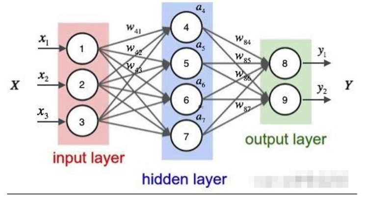

**3-1-3、RNN的基础知识**

**1、循环核介绍**

循环核具有记忆力，通过不同时刻的参数共享，实现了对时间序列的信息提取

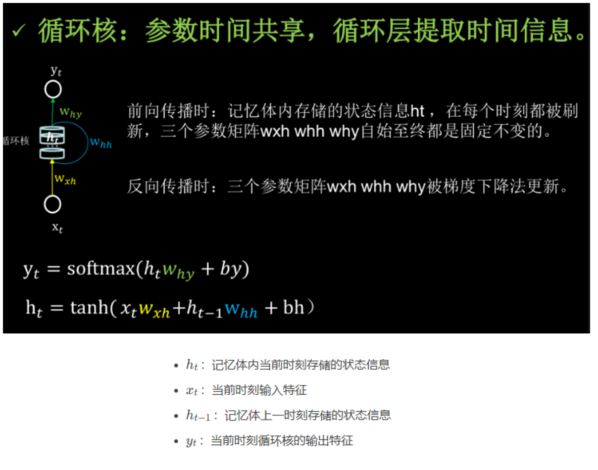


**2、循环核按时间步展开**

按时间步展开，就是把循环核按照时间轴方向展开。每个时刻记忆体状态信息ht被刷新，记忆体周围的参数矩阵wxh、whh和why是固定不变的。要训练优化的就是这些参数矩阵。训练完成后，使用效果最好的参数矩阵，执行前向传播，输出预测结果。循环神经网络，就是借助循环核提取时间特征后，送入全连接网络，实现连续数据的预测。

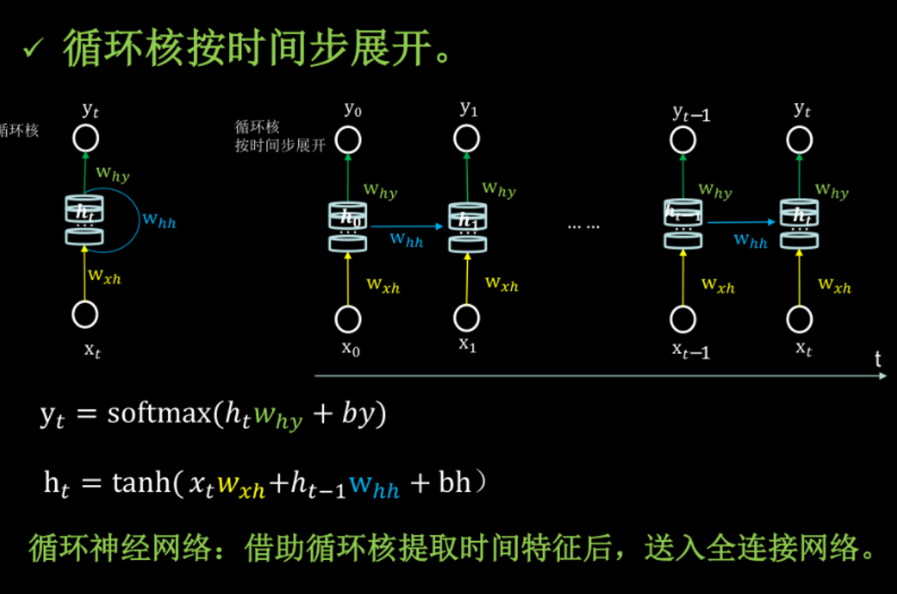


**3、记忆体**

循环核按照时间步展开后，可以发现，循环核是由多个记忆体构成，记忆体是循环神经网络储存历史状态信息的载体，每个记忆体都可以设定相应的个数，这个个数决定了记忆体可以存储历史状态信息的能力，记忆体个数越多，训练效果越好，但是由于记忆体的个数决定了参数矩阵的维度，因此记忆体个数越多，需要训练的参数量就越多，所需要消耗的资源就越大，训练时间就越长，因此需酌情评估。图中的例子中记忆体的个数为3，这个记忆体的个数，决定了ht的维度，进一步决定了Wxh、Whh以及Why的维度。

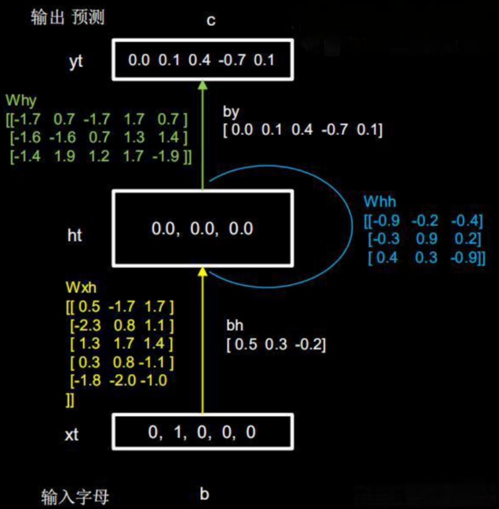

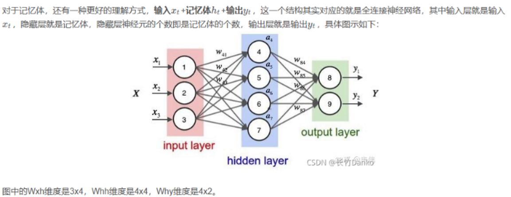

**4、循环计算层**

每个循环核构成一层循环计算层。循环计算层的层数是向输出方向增长的。

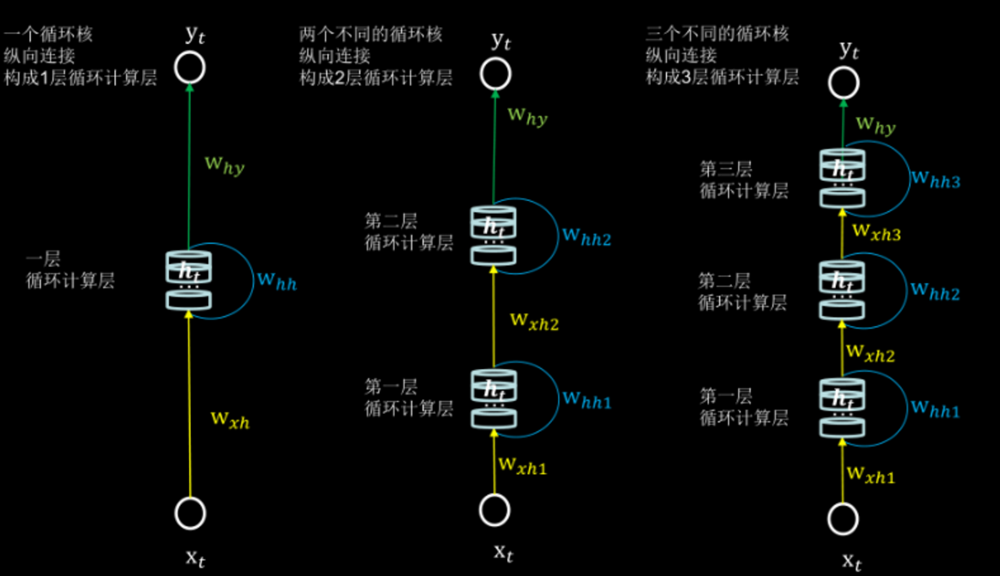

转载自：https://blog.csdn.net/qq_39439006/article/details/121554808


### 3-2、通俗易懂理解RNN

🧠 用一个生活比喻来理解RNN

想象你在看电影时理解剧情的过程：

- **传统神经网络**：像只看电影的一帧画面，不知道前后剧情
- **循环神经网络**：像正常人看电影，能记住前面发生了什么，理解当前画面在整体剧情中的位置

📚 什么是RNN？简单说就是"有记忆的神经网络"

基本概念：

- **普通神经网络**：每次分析都是"从零开始"，没有记忆
- **RNN**：会"记住"之前看到的内容，用来帮助理解现在的内容

就像：

- 读句子时，你理解每个词的意思都依赖于前面的词
- "我今天吃了苹果" vs "我买了苹果手机"
- 同样的"苹果"，意思完全不同，需要前面的语境来理解

🔄 RNN如何工作？"时间旅行"的神经网络

核心机制：

```
输入 → [当前分析 + 之前记忆] → 输出 + 新记忆

```

**具体过程：**

1. 收到新的输入（比如一个新词）
2. 结合"刚才的记忆"来理解这个输入
3. 产生输出（比如理解这个词的意思）
4. 更新记忆，为下一个输入做准备

举个读句子的例子：

```
句子："我爱" + "吃" + "苹果"

```

**第一步：看到"我爱"**

- 记忆：空
- 输出：这是一个关于喜好的句子
- 新记忆：主题是"喜欢某物"

**第二步：看到"吃"**

- 记忆：主题是"喜欢某物"
- 输出：喜欢与吃相关的东西
- 新记忆：喜欢+吃 → 可能是食物

**第三步：看到"苹果"**

- 记忆：喜欢吃的食物
- 输出：喜欢吃的苹果（水果）
- 新记忆：完整的句子意思

🏗️ RNN的三种主要类型

1. **基础RNN** - 短期记忆型

- 像金鱼，只能记住最近的一点信息
- 简单但容易"忘记"太早的事情

1. **LSTM** - 长期记忆高手 🎯

- 像聪明的人，能选择性记住重要信息
- 有三个"门"来控制记忆：
  - **输入门**：决定什么新信息要记住
  - **忘记门**：决定什么旧信息要忘记
  - **输出门**：决定输出什么信息

1. **GRU** - 简化版LSTM

- 像LSTM的弟弟，简单但有效
- 只有两个门，计算更快

🌟 RNN的实际应用场景

📝 文本相关：

- **机器翻译**：理解整个句子再翻译
- **聊天机器人**：记住对话历史
- **文章生成**：写小说时保持情节连贯

🎵 音频处理：

- **语音识别**：根据前后语音判断当前词
- **音乐生成**：创作连贯的旋律

⏰ 时间序列：

- **股票预测**：基于历史价格预测未来
- **天气预报**：基于过去天气预测未来

🆚 RNN vs 传统神经网络

| 传统神经网络     | RNN                |
| :--------------- | :----------------- |
| 每次输入独立处理 | 考虑输入之间的关联 |
| 像看单张照片     | 像看连续视频       |
| 适合图片分类     | 适合语言、时间序列 |

💡 举个更生活的例子：聊天对话

**你问AI："今天天气怎么样？明天呢？"**

**普通神经网络回答：**

- "今天天气怎么样？" → "今天晴天"
- "明天呢？" → "我不知道你在问什么"

**RNN回答：**

- "今天天气怎么样？" → "今天晴天"
- "明天呢？" → "明天也是晴天" （记得你在问天气）

⚠️ RNN的局限性

主要问题：**记忆有限**

- 就像人记不住太长的故事细节
- 处理很长序列时，会"忘记"开头的内容

**解决方案：**

- **LSTM/GRU**：改善长序列记忆
- **注意力机制**：让模型能"回头看"重要部分

🎯 总结

**RNN = 神经网络 + 记忆功能**

- **核心价值**：能处理有顺序、有关联的数据
- **关键思想**：当前理解依赖于历史信息
- **适用场景**：任何需要"上下文"的任务

就像人类理解语言需要上下文一样，RNN让AI也能具备这种"联系前后文"的能力！ 🚀


### 3-3、循环神经网络（RNN）实例

在PyTorch2中，`nn.RNN`是一个实现了基本循环神经网络（RNN）的类。它用于处理序列数据并进行时序预测任务。以下是`nn.RNN`的构造方法以及核心参数简介： 

```python
class torch.nn.RNN(
    input_size: int,         # 输入特征的维度
    hidden_size: int,        # 隐藏状态的维度
    num_layers: int = 1,     # RNN层数
    bias: bool = True,       # 是否使用偏置项
    batch_first: bool = False,  # 如果True，输入和输出的维度将是(batch, seq, feature)
    dropout: float = 0,      # 如果num_layers > 1，添加dropout
    bidirectional: bool = False, # 是否使用双向RNN
    nonlinearity: str = 'tanh' # 激活函数，'tanh' 或 'relu'
)
```

核心参数解析

1. **input_size**:
   - 输入特征的维度。对于每个时间步，RNN接收的输入向量的大小。比如，在文本处理中，它可能是词向量的维度。
2. **hidden_size**:
   - 隐藏层的大小，即隐藏状态向量的维度。每个时间步的RNN都会生成一个隐藏状态，表示该时间步的记忆。这个值决定了隐藏状态的大小。
3. **num_layers**:
   - RNN的层数，默认为1。多层RNN通过将多个RNN层堆叠在一起实现。这个参数对模型的学习能力有影响，但也增加了计算的复杂度。
4. **bias**:
   - 是否使用偏置项。默认值为`True`，表示每个RNN层都会有一个偏置项。
5. **batch_first**:
   - 如果设置为`True`，输入和输出的维度顺序会变为`(batch, seq, feature)`，否则是`(seq, batch, feature)`。如果处理的数据集按批次组织，通常选择`batch_first=True`，使得数据处理更加直观。
6. **dropout**:
   - 如果`num_layers > 1`，这个参数会启用dropout，防止过拟合。它定义了每层之间的丢弃概率（dropout的比例）。默认值是`0`，表示不使用dropout。
7. **bidirectional**:
   - 是否使用双向RNN。如果设置为`True`，模型会同时考虑序列的正向和反向信息，这通常有助于提高性能，尤其是在长序列任务中。
8. **nonlinearity**:
   - 激活函数的类型。`'tanh'`是默认值，它会在每个时间步计算隐藏状态时应用`tanh`函数，帮助隐藏状态保持在[-1, 1]的范围内。也可以选择`'relu'`，这是另一种常用的激活函数。

具体示例-猜数字小游戏

```python
import torch
import torch.nn as nn
import torch.optim as optim
import numpy as np

# 设置随机种子
torch.manual_seed(42)


class NumberGuessingRNN(nn.Module):
    def __init__(self, input_size, hidden_size, output_size, num_layers=1):
        super(NumberGuessingRNN, self).__init__()
        self.hidden_size = hidden_size
        self.num_layers = num_layers

        # 嵌入层 - 将数字转换为向量
        self.embedding = nn.Embedding(input_size, hidden_size)

        # RNN层
        self.rnn = nn.RNN(hidden_size, hidden_size, num_layers, batch_first=True)

        # 输出层
        self.fc = nn.Linear(hidden_size, output_size)

    def forward(self, x, hidden=None):
        # 嵌入层
        embedded = self.embedding(x)

        # RNN层
        if hidden is None:
            rnn_out, hidden = self.rnn(embedded)
        else:
            rnn_out, hidden = self.rnn(embedded, hidden)

        # 只取最后一个时间步的输出
        last_output = rnn_out[:, -1, :]

        # 全连接层
        output = self.fc(last_output)

        return output, hidden


def generate_sequence_data(seq_length=5, num_samples=1000, max_num=20):
    """生成数字序列数据"""
    sequences = []
    targets = []

    for _ in range(num_samples):
        # 生成随机起始数字
        start = np.random.randint(0, max_num - seq_length)

        # 创建序列 (例如: [3,4,5,6,7])
        seq = [start + i for i in range(seq_length)]
        sequences.append(seq)

        # 目标是序列的下一个数字 (例如: 8)
        target = start + seq_length
        targets.append(target)

    return np.array(sequences), np.array(targets)


def train_model():
    """训练模型"""
    # 生成训练数据
    sequences, targets = generate_sequence_data(seq_length=5, num_samples=10000, max_num=50)
    print(sequences, len(sequences))
    print(targets, len(targets))
    # 转换为PyTorch张量
    sequences_tensor = torch.tensor(sequences, dtype=torch.long)
    targets_tensor = torch.tensor(targets, dtype=torch.long)

    # 创建数据集
    dataset = torch.utils.data.TensorDataset(sequences_tensor, targets_tensor)
    dataloader = torch.utils.data.DataLoader(dataset, batch_size=32, shuffle=True)

    # 模型参数
    input_size = 51  # 0-50
    hidden_size = 64
    output_size = 51  # 0-50
    num_layers = 2

    # 创建模型
    model = NumberGuessingRNN(input_size, hidden_size, output_size, num_layers)

    # 损失函数和优化器
    criterion = nn.CrossEntropyLoss()
    optimizer = optim.Adam(model.parameters(), lr=0.001)

    # 训练循环
    for epoch in range(100):
        epoch_loss = 0
        for batch_sequences, batch_targets in dataloader:
            # 前向传播
            outputs, _ = model(batch_sequences)
            loss = criterion(outputs, batch_targets)

            # 反向传播
            optimizer.zero_grad()  # 清空梯度
            loss.backward()  # 反向传播
            optimizer.step()  # 更新参数

            print(f'Epoch [{epoch}], Loss: {loss:.4f}')

    return model


def play_game(model, max_num=50):
    """与训练好的模型玩猜数字游戏"""
    model.eval()

    print("\n=== 数字猜测游戏 ===")
    print("规则: 输入一个数字序列，模型会预测下一个数字")
    print(f"数字范围: 0-{max_num}")
    print("输入'quit'退出游戏\n")

    while True:
        user_input = input("请输入一个递增的数字序列 (例如: 3 4 5 6 7): ")

        if user_input.lower() == 'quit':
            break

        try:
            # 解析输入
            sequence = [int(num) for num in user_input.split()]

            # 准备输入数据
            input_tensor = torch.tensor([sequence], dtype=torch.long)

            # 模型预测
            with torch.no_grad():  # 禁用梯度计算
                output, _ = model(input_tensor)  # 模型预测
                predicted = torch.argmax(output, dim=1).item()  # 获取预测结果

            # 显示结果
            actual_next = sequence[-1] + 1
            print(f"序列: {sequence}")
            print(f"模型预测的下一个数字: {predicted}")
            print(f"实际的下一个数字: {actual_next}")

            if predicted == actual_next:
                print("✅ 模型猜对了!")
            else:
                print("❌ 模型猜错了!")

        except Exception as e:
            print(f"发生错误: {e}")


if __name__ == "__main__":
    # 训练模型
    print("开始训练模型...")
    model = train_model()

    # 玩游戏
    play_game(model)
```

运行输出：

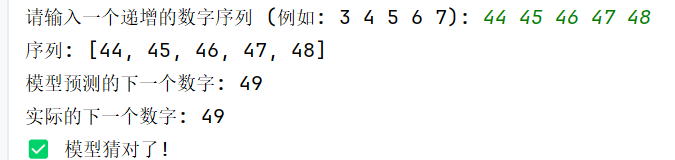


## 4、生成式对抗网络（GAN）


### 生成对抗网络（GAN）简介

#### GAN简介

生成对抗网络是一种**无监督深度学习模型**，其核心思想是通过让两个神经网络相互“竞争”或“对抗”来学习。这两个网络分别是：

1. **生成器**： 它的目标是学习真实数据的分布，并生成足以“以假乱真”的虚假数据。它接收一个随机噪声向量作为输入，输出一个伪造的数据样本。
2. **判别器**： 它的目标是成为一个“鉴定专家”，能够正确区分输入的数据是来自真实数据集还是生成器生成的假数据。它接收一个数据样本，输出一个标量，表示该样本为真的概率。

**对抗过程**可以类比为：

- **生成器** 像一个**伪造者**，努力制作更逼真的假画。
- **判别器** 像一个**鉴定专家**，努力识别出画作的真伪。
- 两者不断博弈，最终**伪造者（生成器）的技能变得如此高超，以至于它生成的画作让鉴定专家（判别器）也无法分辨真伪（输出概率接近0.5）**。

GAN在多个领域具有广泛的应用，特别是在生成式任务中，如：

- **图像生成**：生成高度真实的图像，如人脸图像（例如DeepFake）和艺术风格转换。
- **图像超分辨率**：提高图像分辨率，生成高清晰度图像。
- **图像修复**：填补图像中的缺失部分，修复损坏的图像。
- **数据增强**：生成更多的训练样本，尤其在数据稀缺时。
- **文本到图像生成**：根据文本描述生成对应的图像（例如“一个红色的苹果”生成一张苹果的图像）

#### GAN基本架构图


#### GAN损失函数的定义


### 生成对抗网络（GAN）示例

我们以生成手写数字数据集为示例：

```python
import torch
import torch.nn as nn
import torch.optim as optim
import torchvision
import torchvision.transforms as transforms
from torch.utils.data import DataLoader
import os

# 创建保存图像的文件夹
os.makedirs("gan_images", exist_ok=True)
os.makedirs("models", exist_ok=True)

# 超参数设置
batch_size = 128
latent_dim = 100  # 噪声向量维度
hidden_dim = 256
image_dim = 28 * 28  # MNIST图像尺寸
num_epochs = 100
learning_rate = 0.0002
sample_interval = 200  # 每隔多少批次保存一次样本

# 数据预处理
transform = transforms.Compose([
    transforms.ToTensor(),
    transforms.Normalize((0.5,), (0.5,))  # 将像素值从[0,1]归一化到[-1,1]
])

# 加载MNIST数据集[citation:2][citation:3]
train_dataset = torchvision.datasets.MNIST(
    root='./data',
    train=True,
    transform=transform,
    download=True
)

train_loader = DataLoader(
    train_dataset,
    batch_size=batch_size,
    shuffle=True
)


# 定义生成器[citation:2][citation:5]
class Generator(nn.Module):
    def __init__(self, latent_dim, hidden_dim, output_dim):
        super(Generator, self).__init__()
        self.model = nn.Sequential(
            nn.Linear(latent_dim, hidden_dim),
            nn.ReLU(inplace=True),  # inplace=True参数表示直接在原tensor上进行修改，不创建新的tensor，可以节省内存空间
            nn.Linear(hidden_dim, hidden_dim * 2),
            nn.ReLU(inplace=True),
            nn.Linear(hidden_dim * 2, hidden_dim * 4),
            nn.ReLU(inplace=True),
            nn.Linear(hidden_dim * 4, output_dim),
            nn.Tanh()  # 输出范围[-1, 1]，与预处理匹配
        )

    # 生成器类的前向传播函数。功能是接收随机噪声z作为输入，通过内部模型生成图像数据，并将输出重塑为28x28的单通道图像格式。
    def forward(self, z):
        img = self.model(z)
        """
        将输入的图像张量重新调整形状为(batch_size, 1, 28, 28)的格式。具体来说：
        img.size(0)保持批次大小不变
        将图像转换为单通道（1）
        调整图像尺寸为28×28像素
        使用view()方法进行张量重塑，不改变数据内容只改变维度排列
        """
        img = img.view(img.size(0), 1, 28, 28)
        return img


# 定义判别器[citation:2][citation:5]
class Discriminator(nn.Module):
    def __init__(self, input_dim, hidden_dim):
        super(Discriminator, self).__init__()
        self.model = nn.Sequential(
            nn.Linear(input_dim, hidden_dim * 4),
            nn.LeakyReLU(0.2, inplace=True),  # 0.2 是负轴部分的斜率系数，当输入为负值时，输出为输入值乘以0.2
            nn.Dropout(0.3),
            nn.Linear(hidden_dim * 4, hidden_dim * 2),
            nn.LeakyReLU(0.2, inplace=True),
            nn.Dropout(0.3),
            nn.Linear(hidden_dim * 2, hidden_dim),
            nn.LeakyReLU(0.2, inplace=True),
            nn.Dropout(0.3),
            nn.Linear(hidden_dim, 1),
            nn.Sigmoid()  # 输出0-1的概率值
        )

    def forward(self, img):
        """
            这段代码的功能是将输入的图像数据进行展平操作。
            具体来说：
            img.view() 是PyTorch中的张量重塑方法
            img.size(0) 获取批次大小（batch size）
            -1 表示自动计算该维度的大小，将图像的所有像素展平成一维向量
            结果是将形状为 [batch_size, channels, height, width] 的图像张量转换为 [batch_size, channels×height×width] 的二维张量
            这样做的目的是将多维的图像数据转换为全连接层可以处理的一维向量格式。
        """
        flattened = img.view(img.size(0), -1)
        validity = self.model(flattened)
        return validity


# 初始化模型
generator = Generator(latent_dim, hidden_dim, image_dim)
discriminator = Discriminator(image_dim, hidden_dim)

# 定义损失函数和优化器[citation:2][citation:3]
"""
这段代码创建了一个Adam优化器用于训练生成器。
功能解释：
optim.Adam() - 创建Adam优化算法实例
generator.parameters() - 获取生成器模型的所有可训练参数
lr=learning_rate - 设置学习率为指定值
betas=(0.5, 0.999) - 设置Adam算法的两个动量参数，分别控制一阶和二阶矩估计的指数衰减率
该优化器将用于更新生成器的权重参数以最小化损失函数。
"""
adversarial_loss = nn.BCELoss()
optimizer_G = optim.Adam(generator.parameters(), lr=learning_rate, betas=(0.5, 0.999))
optimizer_D = optim.Adam(discriminator.parameters(), lr=learning_rate, betas=(0.5, 0.999))

# 用于可视化的固定噪声
fixed_noise = torch.randn(64, latent_dim)

# 训练统计
d_losses = []
g_losses = []

print("开始训练GAN...")

# 训练循环[citation:2][citation:3][citation:5]
for epoch in range(num_epochs):
    for i, (real_imgs, _) in enumerate(train_loader):
        batch_size = real_imgs.size(0)

        # 创建标签
        real_labels = torch.ones(batch_size, 1)
        fake_labels = torch.zeros(batch_size, 1)

        # ---------------------
        #  训练判别器
        # ---------------------
        optimizer_D.zero_grad()

        # 计算真实图像的损失
        real_output = discriminator(real_imgs)  # 判别器对真实图像进行预测
        d_loss_real = adversarial_loss(real_output, real_labels)  # 计算真实图像的损失

        # 生成假图像
        z = torch.randn(batch_size, latent_dim)  # 生成随机噪声向量
        fake_imgs = generator(z)  # 生成假图像

        # 计算假图像的损失
        fake_output = discriminator(fake_imgs.detach())  # 判别器对生成的假图像进行预测
        d_loss_fake = adversarial_loss(fake_output, fake_labels)  # 计算假图像的损失

        # 总判别器损失
        d_loss = (d_loss_real + d_loss_fake) / 2  # 计算判别器的损失
        d_loss.backward()  # 反向传播
        optimizer_D.step()  # 更新判别器的权重参数

        # ---------------------
        #  训练生成器
        # ---------------------
        optimizer_G.zero_grad()  # 清空生成器的梯度

        # 生成器希望假图像被判别为真
        output = discriminator(fake_imgs)  # 判别器对生成的假图像进行预测
        g_loss = adversarial_loss(output, real_labels)  # 计算生成器的损失

        g_loss.backward()  # 反向传播
        optimizer_G.step()  # 更新生成器的权重参数

        # 记录损失
        d_losses.append(d_loss.item())  # 记录判别器的损失
        g_losses.append(g_loss.item())  # 记录生成器的损失

        # 定期保存生成的图像[citation:3]
        if i % sample_interval == 0:
            print(f"[Epoch {epoch}/{num_epochs}] [Batch {i}/{len(train_loader)}] "
                  f"[D loss: {d_loss.item():.4f}] [G loss: {g_loss.item():.4f}]")

            # 保存生成图像示例
            with torch.no_grad():  # 禁用梯度计算
                fake_imgs_sample = generator(fixed_noise).detach().cpu()  # 生成假图像

                # 保存为图像网格
                torchvision.utils.save_image(
                    fake_imgs_sample,
                    f"gan_images/epoch_{epoch}_batch_{i}.png",
                    nrow=8,
                    normalize=True
                )
```

kaggle Notebook地址：

https://www.kaggle.com/code/hideself/gan-train/edit


# 四、模型的保存

在 PyTorch 中保存和加载模型最简单且推荐的方法是使用模型的 **`state_dict`**（即模型的参数字典）。以下是具体步骤：

1. **保存模型**

训练完模型后，保存它的 `state_dict` 到文件：
```python
torch.save(model.state_dict(), 'model.pth')
```
- `model` 是你的模型实例。
- `'model.pth'` 是保存的文件名（后缀可以是 `.pth` 或 `.pt`）。

2. **加载模型**

使用模型前，需要先创建相同的模型结构，然后加载保存的参数：
```python
# 创建与原模型结构相同的实例（假设类名为 MyModel）
model = MyModel()
model.load_state_dict(torch.load('model.pth'))
model.eval()  # 切换到评估模式（如关闭 dropout 等）
```

3. **使用加载的模型进行预测**

```python
with torch.no_grad():  # 推理时不需要计算梯度
    output = model(input_data)
```

---

**补充：为什么推荐 `state_dict` 而不是保存整个模型？**

- **更安全**：保存整个模型（`torch.save(model, 'model.pth')`）可能会因为代码结构变化或跨环境导致加载失败。
- **更灵活**：你可以只加载参数，适用于模型结构调整或迁移学习。

按照上述三步走，你就能轻松保存并使用 PyTorch 模型了。


# 附录1：源码上传网址

源码仓库地址：
https://github.com/hide-self/PyTorch_Learning_Source_Code